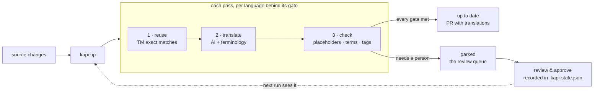

# Kapi Action

A GitHub Action that runs [kapi](https://github.com/neokapi/neokapi) commands — catch up translations, gate content quality, plan cost — and delivers the results — as a commit, a pull request, or a report on the PR that caused the work.

## Prerequisites

This action requires the `kapi` CLI to be installed. Use [`neokapi/setup-kapi@v1`](https://github.com/neokapi/setup-kapi) to install it (the bowrain plugin is included by default), or add it to `PATH` yourself.

## Usage

### Bring translations up to date

`kapi up` runs the kapi loop, and is the Action's default. In a server-connected project — a recipe with a `server:` block — it pushes, catches up on the Bowrain server (org keys, shared TM, team review), and pulls the produced targets back. With no server it runs the same loop locally.

```yaml
name: Translations
on:
  schedule:
    - cron: "0 6 * * 1-5" # weekdays at 06:00 UTC
  workflow_dispatch:

permissions:
  contents: write

jobs:
  up:
    runs-on: ubuntu-latest
    steps:
      - uses: actions/checkout@v6

      - uses: neokapi/setup-kapi@v1

      - uses: neokapi/kapi-action@v1
```

### Outcomes

A `kapi up` run ends in one of three states, and the Action treats them differently:

| Run state | What it means | What the Action does |
|---|---|---|
| **converged** | Every gated scope cleared its ship gate — the project is up to date | Delivers the produced translations |
| **parked** | Work remains that the loop could not carry to the gate (a failing check, an unreachable gate) | Delivers what it *did* catch up, and annotates the run with the parked locales. This is normal pending work, not a failure |
| **failed / canceled** | The run broke (a provider outage, a server error, a cancel) | `kapi up` exits non-zero, the step fails, **nothing is delivered** |

Parked is the interesting one: partial progress is real progress, so the default is to deliver it and warn rather than throw it away. To block instead:

```yaml
- uses: neokapi/kapi-action@v1
  with:
    fail-on-parked: "true"
```

### How the loop works

`kapi up` treats the recipe as the desired state — the languages the project targets, and the ship gates that define *shippable* — and reconciles the content toward it. Each pass, for every language behind its gate:

1. **Reuse** — exact translation-memory matches fill first, for free.
2. **Translate** — the configured AI provider fills what remains, with the project's terminology and brand context.
3. **Check** — deterministic checks run over what was produced (placeholder integrity, inline tags, do-not-translate terms, untranslated text). A unit with a failing finding counts as *drafted*, not translated — it cannot clear a gate until fixed.

Passes repeat until every language clears its gate, a pass makes no progress, or the pass cap is reached.



**Parked work is the review queue, not an error.** What the machine couldn't decide waits for a person: review the wording, approve or fix it, and the decision is recorded — in the committed `.kapi-state.json` state store, or on the connected server. Approvals raise the `reviewed` coverage the ship gate measures, so the next run and the next gate see them. `kapi check --ship` (see [Gate pull requests](#gate-pull-requests-on-content-quality)) is what enforces the bar at release time.

The kapi up report (outcome, passes, parked locales) is always written to the job summary. Under the hood the Action runs `kapi up --json`, an NDJSON stream — one convergence event per line, closed by a single `{"type":"result", ...}` record. That record is the contract; the events are the log. It becomes the `outcome`, `passes`, and `parked-locales` outputs.

### Deliver as a pull request

By default the Action commits to the current branch. With `create-pull-request: "true"` it delivers a branch + PR instead — the reviewable unit, and the path that works with branch protection on the default branch:

```yaml
permissions:
  contents: write
  pull-requests: write

steps:
  - uses: neokapi/kapi-action@v1
    with:
      create-pull-request: "true"
```

The created PR carries the kapi up report in its description. `pr-title`, `pr-labels`, `pr-base`, and `branch-prefix` tune it; labels are applied best-effort (a label that doesn't exist in the repo never fails the run). The PR URL lands in the `pull-request-url` output.

### Plan mode: the cost of a change, on its PR

`plan: "true"` dry-runs the kapi loop — pending work, TM leverage, and a token estimate, with no writes and no provider calls (so it needs no API keys). With `pr-comment: "true"` on a pull-request event, the plan lands as one sticky comment that re-runs update in place:

```yaml
name: Translation plan
on:
  pull_request:
    paths: ["src/locales/en/**", "content/**"]

permissions:
  pull-requests: write

jobs:
  plan:
    runs-on: ubuntu-latest
    steps:
      - uses: actions/checkout@v6
      - uses: neokapi/setup-kapi@v1
      - uses: neokapi/kapi-action@v1
        with:
          plan: "true"
          pr-comment: "true"
```

> "This change leaves **42 unit(s)** of pending translation work: 30 recoverable from TM, 12 for AI (~450 tokens estimated)."

### Gate pull requests on content quality

`command: check` with `--ship` is the release bar: the project's bound quality gates (brand, terminology, QA) plus its ship/source coverage gates. An unmet gate exits `3`, which the Action surfaces as a distinct **"gate unmet"** annotation (not a generic failure) and as the `gate` output:

```yaml
name: Ship gate
on:
  pull_request:
    paths: ["content/**", "src/locales/**"]

permissions:
  pull-requests: write

jobs:
  ship-gate:
    runs-on: ubuntu-latest
    steps:
      - uses: actions/checkout@v6
      - uses: neokapi/setup-kapi@v1
      - uses: neokapi/kapi-action@v1
        with:
          command: check
          args: "--ship"
          commit: "false"
          pr-comment: "true"
```

Ordinary builds never fail on target-language drift — a locale that is behind is pending work, not an error. `check --ship` is the explicit, opt-in enforcement point.

### Run any other kapi command

`command` takes any kapi subcommand — the Action stays a general runner. The loop outputs (`outcome`, `passes`, `parked-locales`) are only populated for `up`.

```yaml
- uses: neokapi/kapi-action@v1
  with:
    command: run
    args: "translate"
    project: "myproject.kapi"
    paths: "src/locales/"
    commit-message: "chore: update translations"
```

This runs `kapi run -p myproject.kapi translate`.

### Caching

The loop runs incrementally via the project's `.kapi/cache` (block store, extractions), which is gitignored and therefore rebuilt on every fresh runner. Restore it across runs to skip re-extraction:

```yaml
- uses: actions/cache@v5
  with:
    path: .kapi/cache
    key: kapi-cache-${{ hashFiles('*.kapi', 'src/locales/en/**') }}
    restore-keys: kapi-cache-
```

Server-connected projects don't need this — the project state lives on the server.

## Inputs

| Input | Default | Description |
|---|---|---|
| `command` | `up` | Kapi subcommand to execute |
| `args` | | Additional arguments |
| `project` | | Path to `.kapi` project file (`-p` flag) |
| `plan` | `false` | With `command: up`: dry run — pending work, TM leverage, token estimate; no writes, no provider calls |
| `fail-on-parked` | `false` | With `command: up`, fail the workflow when the run parks instead of committing partial progress |
| `commit` | `true` | Whether to commit changes |
| `commit-message` | `chore: update translations via kapi` | Commit message |
| `create-pull-request` | `false` | Deliver as a branch + PR instead of pushing the current branch |
| `pr-title` | `chore: update translations via kapi` | Title for the created PR |
| `pr-labels` | `translations,kapi` | Comma-separated labels (best-effort) |
| `pr-base` | | Base branch for the PR (empty = repository default) |
| `branch-prefix` | `kapi/up` | Branch prefix for PR delivery |
| `pr-comment` | `false` | Sticky report comment on pull-request events |
| `token` | `${{ github.token }}` | Token for PR creation and comments |
| `git-user-name` | `Kapi Bot` | Git committer name |
| `git-user-email` | `bot@kapi.dev` | Git committer email |
| `paths` | | Space-separated paths to stage for commit (all changes if empty) |

## Outputs

| Output | Description |
|---|---|
| `status` | `success`, `no-changes`, or `failed` |
| `outcome` | With `command: up`: `converged` or `parked` (a failed run fails the step, so it never reaches an output) |
| `passes` | With `command: up`: how many reconciliation passes the run took |
| `parked-locales` | With `command: up`: comma-separated locales still short of their gate |
| `gate` | With `command: check`: `pass` or `fail` |
| `plan-missing` / `plan-tm-exact` / `plan-ai-remaining` / `plan-token-estimate` | With `plan: true`: the plan totals |
| `committed` | `true` or `false` |
| `commit-sha` | SHA of the created commit (empty if no commit) |
| `pull-request-url` | URL of the created PR (empty if none) |

## Permissions

`permissions: contents: write` for commit/push delivery; add `pull-requests: write` for `create-pull-request` and `pr-comment`.

## License

Apache-2.0 - see [LICENSE](LICENSE).
