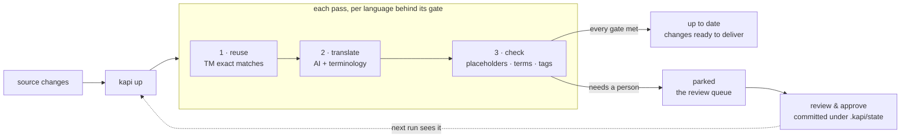

# Kapi Action

A GitHub Action that runs [kapi](https://github.com/neokapi/neokapi) commands — catch up translations, gate content quality, plan cost — and delivers the results — as a commit, a pull request, or a report on the PR that caused the work.

## Prerequisites

This action requires the `kapi` CLI to be installed. Use [`neokapi/setup-kapi@v1`](https://github.com/neokapi/setup-kapi) to install it (the bowrain plugin is included by default), or add it to `PATH` yourself.

## Usage

### Bring translations up to date

`kapi up` runs the kapi loop, and is the Action's default. It needs kapi 1.2.0 or later, which `neokapi/setup-kapi@v1` installs by default. In a server-connected project, a recipe with a `bowrain:` block, it pushes, catches up on the Bowrain server, and pulls the produced targets back; give setup-kapi the server token. With no server it runs the same loop locally and needs an AI provider key, such as `ANTHROPIC_API_KEY`.

```yaml
name: Translations
on:
  schedule:
    - cron: "0 6 * * 1-5" # weekdays at 06:00 UTC
  workflow_dispatch:

permissions:
  contents: write

jobs:
  up:
    runs-on: ubuntu-latest
    steps:
      - uses: actions/checkout@v6

      - uses: neokapi/setup-kapi@v1
        with:
          # A recipe with a bowrain: block runs the loop on the server.
          auth-token: ${{ secrets.BOWRAIN_AUTH_TOKEN }}

      - uses: neokapi/kapi-action@v1
        env:
          # A project with no server translates locally with your provider key.
          ANTHROPIC_API_KEY: ${{ secrets.ANTHROPIC_API_KEY }}

      # The action reports; delivery is your step. Any commit action works,
      # or plain git. See "Delivering the changes" for the PR-based recipe.
      - uses: stefanzweifel/git-auto-commit-action@v5
        with:
          commit_message: "chore: update translations via kapi"
```

### Outcomes

A `kapi up` run ends in one of three states, and the Action treats them differently:

| Run state | What it means | What the Action does |
|---|---|---|
| **converged** | Every gated scope cleared its ship gate — the project is up to date | Reports the produced translations (`has-changes`, `changed-files`) for your delivery step |
| **parked** | Work remains that the loop could not carry to the gate (a failing check, an unreachable gate) | Reports what it *did* catch up, and annotates the run with the parked locales. This is normal pending work, not a failure |
| **failed / canceled** | The run broke (a provider outage, a server error, a cancel) | `kapi up` exits non-zero, the step fails, **`has-changes` never reports** — a broken run must not hand your delivery step partial work |

Parked is the interesting one: partial progress is real progress, so the default is to report it and warn rather than throw it away. To block instead:

```yaml
- uses: neokapi/kapi-action@v1
  with:
    fail-on-parked: "true"
```

### How the loop works

`kapi up` treats the recipe as the desired state — the languages the project targets, and the ship gates that define *shippable* — and reconciles the content toward it. Each pass, for every language behind its gate:

1. **Reuse** — exact translation-memory matches fill first, for free.
2. **Translate** — the configured AI provider fills what remains, with the project's terminology and brand context.
3. **Check** — deterministic checks run over what was produced (placeholder integrity, inline tags, do-not-translate terms, untranslated text). A unit with a failing finding counts as *drafted*, not translated — it cannot clear a gate until fixed.

Passes repeat until every language clears its gate, a pass makes no progress, or the pass cap is reached.


```mermaid
flowchart LR
    S[source changes] --> U[kapi up]
    subgraph PASS ["each pass, per language behind its gate"]
        TM["1 · reuse<br/>TM exact matches"] --> AI["2 · translate<br/>AI + terminology"] --> CK["3 · check<br/>placeholders · terms · tags"]
    end
    U --> PASS
    CK -->|every gate met| CV["up to date<br/>changes ready to deliver"]
    CK -->|needs a person| PK["parked<br/>the review queue"]
    PK --> RV["review & approve<br/>committed under .kapi/state"]
    RV -.->|next run sees it| U
```

**Parked work is the review queue, not an error.** What the machine couldn't decide waits for a person: review the wording, approve or fix it, and `kapi commit` records the decision under `.kapi/state/`, or the connected server records it. Approvals raise the `reviewed` coverage the ship gate measures, so the next run and the next gate see them. `kapi check --ship` (see [Gate pull requests](#gate-pull-requests-on-content-quality)) is what enforces the bar at release time.

The kapi up report (outcome, passes, parked locales) is always written to the job summary. Under the hood the Action runs `kapi up --json`, an NDJSON stream — one convergence event per line, closed by a single `{"type":"result", ...}` record. That record is the contract; the events are the log. It becomes the `outcome`, `passes`, and `parked-locales` outputs.

### Delivering the changes

The action never commits, pushes, or opens PRs. It leaves the produced
translations in the working tree and reports them (`has-changes`,
`changed-files`), so delivery is a step you own — which also means the token,
the authorship, and the review policy are yours, stated in your workflow
instead of hidden in ours.

Straight commit to the current branch:

```yaml
- uses: neokapi/kapi-action@v1
  id: kapi

- uses: stefanzweifel/git-auto-commit-action@v5
  if: steps.kapi.outputs.has-changes == 'true'
  with:
    commit_message: "chore: update translations via kapi"
```

As a pull request — the reviewable unit, and the shape that respects the
"machine proposes, a person decides" model:

```yaml
- uses: neokapi/kapi-action@v1
  id: kapi

- uses: peter-evans/create-pull-request@v7
  if: steps.kapi.outputs.has-changes == 'true'
  with:
    commit-message: "chore: update translations via kapi"
    title: "Translations: kapi up"
    branch: kapi/up
```

**One GitHub behavior to know:** anything pushed with the workflow-provided
`GITHUB_TOKEN` triggers **no workflows** — no CI on the commit, no checks on
the created PR, no deploy when it lands on main. That is GitHub loop
prevention, not a kapi limitation. If CI or deploys should react to the
delivered translations, give the delivery step a fine-grained PAT or a GitHub
App token instead (both delivery actions above accept a `token:` input).

### Plan mode: the cost of a change, on its PR

`plan: "true"` dry-runs the kapi loop — pending work, TM leverage, and a token estimate, with no writes and no provider calls (so it needs no API keys). With `pr-comment: "true"` on a pull-request event, the plan lands as one sticky comment that re-runs update in place:

```yaml
name: Translation plan
on:
  pull_request:
    paths: ["src/locales/en/**", "content/**"]

permissions:
  pull-requests: write

jobs:
  plan:
    runs-on: ubuntu-latest
    steps:
      - uses: actions/checkout@v6
      - uses: neokapi/setup-kapi@v1
      - uses: neokapi/kapi-action@v1
        with:
          plan: "true"
          pr-comment: "true"
```

> "This change leaves **42 unit(s)** of pending translation work: 30 recoverable from TM, 12 for AI (~450 tokens estimated)."

### Gate pull requests on content quality

`command: check` with `--ship` is the release bar: the project's bound gates (voice, terminology, rule-based checks) plus its ship and source coverage gates. An unmet gate exits `3`, which the Action surfaces as a distinct **"gate unmet"** annotation (not a generic failure), as `gate: fail` and as `result: failed`:

```yaml
name: Ship gate
on:
  pull_request:
    paths: ["content/**", "src/locales/**"]

permissions:
  pull-requests: write

jobs:
  ship-gate:
    runs-on: ubuntu-latest
    steps:
      - uses: actions/checkout@v6
      - uses: neokapi/setup-kapi@v1
      - uses: neokapi/kapi-action@v1
        with:
          command: check
          args: "--ship"
          pr-comment: "true"
```

Ordinary builds never fail on target-language drift — a locale that is behind is pending work, not an error. `check --ship` is the explicit, opt-in enforcement point.

A failing gate still reports: `status` is `failed`, `has-changes` is set, and with `pr-comment` the sticky comment shows the result. The step keeps the gate's exit code, so the job fails.

#### When a check does not run

A check can also end without a verdict. kapi exits `4` when the check did not run: it checked no content, or it could not show that its checkers are able to fail. The Action fails the step and reports this as its own result: `result` is `did_not_run`, `gate` stays empty, `status` is `failed`, and `did-not-run-cause` carries the cause kapi named. The step's error annotation, the job summary and, with `pr-comment`, the sticky PR comment state the cause in words.

| `did-not-run-cause` | What it means |
|---|---|
| `checker_invalid` | A checker failed its canary, so the run's result cannot be trusted. Read it as neither a pass nor a gate failure, and fix or report the checker. |
| `nothing_to_check` | There was nothing in scope to check. |
| `content_not_checked` | Content in scope was not checked, for example a gate named with `--gate` that has nothing bound in the recipe, or a changed file whose blocks could not be located. |
| `unknown` | kapi's output named no cause. |

The Action reads the cause from the report kapi printed, in whichever format `args` asks for (text, `--json`, or `--output-format yaml`), and passes your command line through unchanged. kapi releases that predate the did-not-run verdict never exit `4`; with them the step behaves as before, and `result` is `passed`, `failed`, or `error`.

### Run any other kapi command

`command` takes any kapi subcommand — the Action stays a general runner. The loop outputs (`outcome`, `passes`, `parked-locales`) are only populated for `up`.

```yaml
- uses: neokapi/kapi-action@v1
  with:
    command: run
    args: "translate"
    project: "kapi.yaml"
    paths: "src/locales/"
```

This runs `kapi run -p kapi.yaml translate`.

### Share the project's context

A project whose `kapi.yaml` declares a context backend keeps its terms, voice
profiles, approved wording and decisions there rather than in files the
repository carries:

```yaml
context:
  backend: git        # the context lives on refs/kapi/context in this repository
```

`context-sync` moves it around the run: `pull` takes in what the team pushed
before the command runs, and `true` also pushes what the run recorded after it.

```yaml
permissions:
  contents: write     # push the context ref
steps:
  - uses: actions/checkout@v5
  - uses: neokapi/setup-kapi@v1
  - uses: neokapi/kapi-action@v1
    with:
      command: up
      context-sync: true
```

A pull request from a fork can pull and cannot push, so use `context-sync: pull`
there. A pull or push that cannot reach the backend exits with status 5 and
changes nothing.

### Caching

`neokapi/setup-kapi@v1` carries kapi's parse cache (`.kapi/work/cache/docs`) between runs. Its `cache-tm` input is on by default for a project with a `kapi.yaml`, so this Action needs no cache step of its own. Set setup-kapi's `project-dir` when the recipe is not at the repository root.

Leave the rest of `.kapi/work/` out of any cache. Its store holds the targets and review state a run produced, and a restored copy changes what `kapi status`, `kapi check --ship` and `kapi up` report.

## Inputs

| Input | Default | Description |
|---|---|---|
| `command` | `up` | Kapi subcommand to execute |
| `args` | | Additional arguments |
| `project` | | Path to the `kapi.yaml` recipe (`-p` flag) |
| `plan` | `false` | With `command: up`: dry run — pending work, TM leverage, token estimate; no writes, no provider calls |
| `fail-on-parked` | `false` | With `command: up`, fail the workflow when the run parks instead of reporting partial progress |
| `pr-comment` | `false` | Sticky report comment on pull-request events, including for a failed gate or a check that did not run |
| `token` | `${{ github.token }}` | Token for the sticky PR comment |
| `paths` | | Space-separated paths to scan for changes (whole working tree if empty) |
| `context-sync` | `false` | `pull` runs `kapi context pull` before the command; `true` also runs `kapi context push` after it, except in plan mode (kapi 1.3 and later) |

## Outputs

| Output | Description |
|---|---|
| `status` | `success`, `no-changes`, or `failed` (with `command: check`: a failed gate or a check that did not run) |
| `outcome` | With `command: up`: `converged` or `parked` (a failed run fails the step, so it never reaches an output) |
| `passes` | With `command: up`: how many reconciliation passes the run took |
| `parked-locales` | With `command: up`: comma-separated locales still short of their gate |
| `gate` | With `command: check`: `pass` or `fail` (empty when the check did not run or errored) |
| `result` | With `command: check`: `passed` (exit 0), `failed` (exit 3), `did_not_run` (exit 4), or `error` (any other exit code) |
| `did-not-run-cause` | With `command: check`, when `result` is `did_not_run`: `checker_invalid`, `nothing_to_check`, `content_not_checked`, or `unknown` |
| `plan-missing` / `plan-tm-exact` / `plan-ai-remaining` / `plan-token-estimate` | With `plan: true`: the plan totals |
| `has-changes` | Whether the run left changes in the working tree for your delivery step |
| `changed-files` | Newline-separated paths the run changed |

## Permissions

The action itself needs no write permissions, except that `context-sync: true` with a `git` backend pushes the context ref and needs `contents: write`. Your delivery step needs `contents: write` (plus `pull-requests: write` for PR delivery); `pr-comment` needs `pull-requests: write`.

## License

Apache-2.0 - see [LICENSE](LICENSE).
